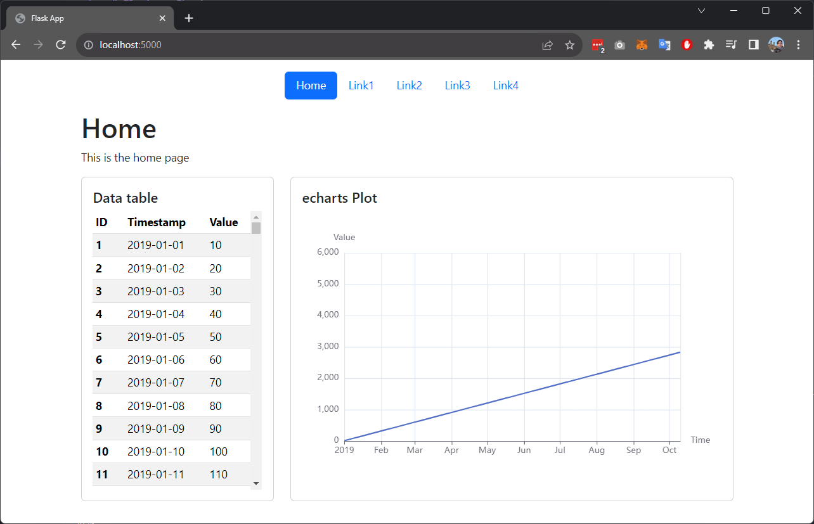

# Flask + eCharts

This project implements a simple web application using Flask and eCharts for dynamic time-series data visualization. It also uses Bootstrapfor styles and jQuery for dynamic web page rendering.



## Requirements
- Python 3.10

## Setup
1. Clone the repository
2. Create a virtual env with python 3.10:
    ```bash
    python3.10 -m venv venv
    ```
3. Activate the virtual env (for linux):
    ```bash
    source venv/bin/activate
    ```
4. Install the requirements:
    ```bash
    pip install -r requirements.txt
    ```
5. Run the application:
    ```bash
    python app.py
    ```